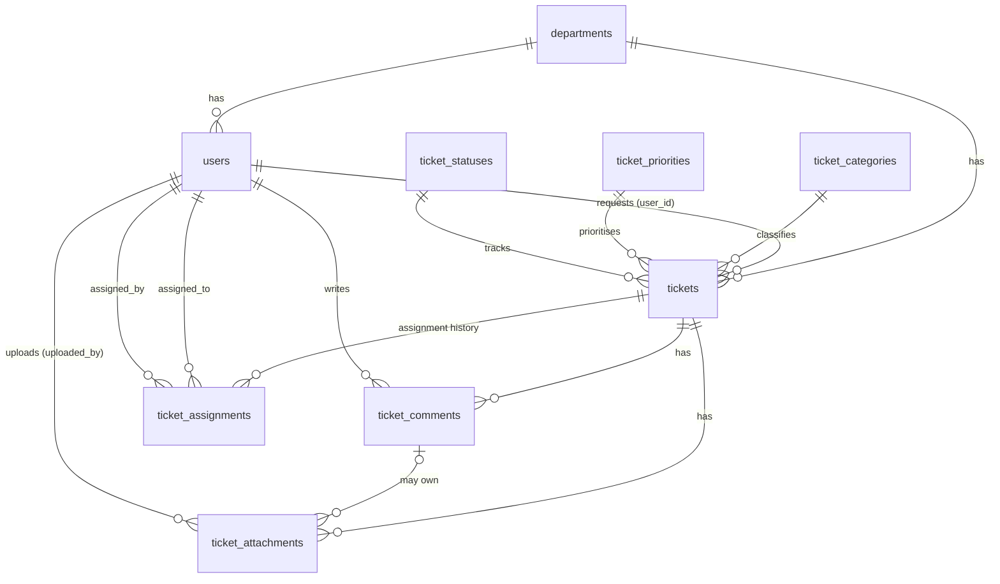

# Database Architecture — IT Support ServiceDesk (Phase 01, updated in Phase 02)

Engine: **MySQL 8.x** (InnoDB, `utf8mb4`). Framework: **Laravel 11**. All schema changes are Laravel migrations; all master data comes from seeders.

## Entity relationships

`notifications` is Laravel's standard polymorphic table (UUID id, `notifiable_type`/`notifiable_id`, `type`, `data`, `read_at`) and is not drawn above.
`personal_access_tokens` (Laravel Sanctum) is also present so the API layer is ready.

## Migrations (run order)

| # | File | Purpose |
|---|------|---------|
| – | `0001_01_01_000000…` | Laravel default users / password resets / sessions (**untouched**) |
| – | `0001_01_01_000001/2…` | Laravel cache / jobs (**untouched**) |
| – | `2026_10_01_044108_create_personal_access_tokens_table` | Sanctum (from `install:api`) |
| 1 | `…100001_create_departments_table` | master |
| 2 | `…100002_create_ticket_categories_table` | master |
| 3 | `…100003_create_ticket_priorities_table` | master |
| 4 | `…100004_create_ticket_statuses_table` | master |
| 5 | `…100005_add_servicedesk_fields_to_users_table` | extends `users` (additive, reversible) |
| 6 | `…100006_create_tickets_table` | core record |
| 7 | `…100007_create_ticket_comments_table` | |
| 8 | `…100008_create_ticket_attachments_table` | |
| 9 | `…100009_create_ticket_assignments_table` | |
| 10 | `…100010_create_notifications_table` | Laravel standard (`make:notifications-table`) |

## Foreign keys and delete behaviour

| Column | References | On delete | Why |
|---|---|---|---|
| `users.department_id` (nullable) | departments | **RESTRICT** | Never silently orphan/destroy users |
| `tickets.user_id` | users | RESTRICT | Preserve requester |
| `tickets.department_id` | departments | RESTRICT | Business record |
| `tickets.category_id` / `priority_id` / `status_id` | master tables | RESTRICT | Referenced master data can't be removed |
| `ticket_comments.ticket_id` | tickets | **CASCADE** | Comments are meaningless without the ticket |
| `ticket_comments.user_id` | users | RESTRICT | Preserve authorship |
| `ticket_attachments.ticket_id` | tickets | CASCADE | Owned by ticket |
| `ticket_attachments.(ticket_id, comment_id)` (nullable `comment_id`) | ticket_comments `(ticket_id, id)` | CASCADE | See below |
| `ticket_attachments.uploaded_by` | users | RESTRICT | Preserve uploader |
| `ticket_assignments.ticket_id` | tickets | CASCADE | History belongs to ticket |
| `ticket_assignments.assigned_to` / `assigned_by` | users | RESTRICT | Never lose who handled/assigned |

### Integrity details worth knowing

* **Attachment ↔ comment consistency.** `comment_id` uses a *composite* FK `(ticket_id, comment_id) → ticket_comments(ticket_id, id)`, so the database rejects an attachment that points at a comment from a different ticket. (MySQL skips the check when `comment_id` is NULL, which is why the plain `ticket_id` FK also exists.)
* **Comment deletion cascades to its attachments** (instead of `SET NULL`) deliberately: `SET NULL` would turn an attachment of an *internal* note into a ticket-level file visible to the requester. Removing the physical files is the job of the upload service in a later phase.
* **One open assignment per ticket.** `ticket_assignments.is_current` is a *generated* column (`1` while `unassigned_at IS NULL`, else `NULL`) with a unique index on `(ticket_id, is_current)`. History rows are unlimited; open rows are limited to one per ticket by the database. A reassignment must close the previous row first (do it in a transaction in the service layer).
* **`tickets.department_id`** is intentionally captured at creation (requester's department then) so historical reports stay correct if the user later moves department.
* **`users.role`** is a DB `ENUM` built from `App\Enums\UserRole`, so the DB rejects invalid roles. Adding a role = new enum case **and** a migration altering the column.

## Indexes (based on query patterns)

| Table | Index | Serves |
|---|---|---|
| users | `email` (unique), `employee_id` (unique, NULLs allowed), `(role, is_active)`, `department_id` (FK) | login, HR lookups, "active support staff" pickers, per-department lists |
| tickets | `ticket_number` (unique), `(status_id, created_at)`, `created_at`, FK indexes on `user_id`, `department_id`, `category_id`, `priority_id` | ticket lookup, support queue by status newest-first, date-range reports, filters |
| ticket_comments | `(ticket_id, created_at)`, `user_id` (FK), `(ticket_id, id)` unique | conversation timeline, composite FK target |
| ticket_attachments | `(ticket_id, comment_id)` (FK), `comment_id`, `uploaded_by` (FK), `file_path` (unique) | ticket files, comment files, uploader audit, no shared files |
| ticket_assignments | `(ticket_id, is_current)` unique, `(assigned_to, unassigned_at)`, `assigned_by` (FK) | one-open rule, "my current tickets", audit |

Not indexed on purpose: `is_active` on its own (low cardinality; covered as the 2nd column of `users(role, is_active)`), `ticket_statuses.sort_order` (6 rows).

## Soft-delete decision

| Table | Soft deletes? | Reason |
|---|---|---|
| `users` | **Yes** | Referenced by tickets, comments, attachments and assignment history; accounts must be removable without losing history. |
| `departments` | **Yes** | Referenced by users and historical tickets. |
| `ticket_categories` | **Yes** | Referenced by historical tickets. |
| `ticket_priorities` | **Yes** | Referenced by historical tickets. |
| `ticket_statuses` | No | Drive workflow logic; deactivate with `is_active = false` instead. FK `RESTRICT` protects referenced rows. |
| `tickets`, `ticket_comments`, `ticket_attachments`, `ticket_assignments`, `notifications` | **No** | Transactional/audit data. No clear requirement; soft-deleted tickets would silently hide records from reports and complicate cascades. Revisit only if a business rule demands "undelete". |

Consequences:
* Models of soft-deleting parents are loaded with `->withTrashed()` in `Ticket`/`TicketComment`/`TicketAttachment`/`TicketAssignment` relations, so historical records still show who/what they belonged to.
* Unique names stay unique across soft-deleted rows — to reuse a deleted name, **restore** the row. Seeders use `withTrashed()->updateOrCreate()` so re-seeding never collides with a soft-deleted record.

## Single sources of truth

| Concept | Where |
|---|---|
| Roles | `App\Enums\UserRole` |
| Built-in statuses (slug, name, colour, order) | `App\Enums\TicketStatusSlug` → seeded; resolve via `TicketStatus::forSlug()` |
| Built-in priorities (level, colour, SLA defaults) | `App\Enums\TicketPriorityLevel` → seeded; resolve via `TicketPriority::forLevel()` |

The enums for statuses and priorities carry a `Slug`/`Level` suffix so they don't collide with the `TicketStatus` / `TicketPriority` Eloquent models.

## Mass-assignment policy

Every model declares an explicit `$fillable`; none uses `$guarded = []`. Privilege- or system-controlled columns are intentionally **not** fillable:

* `users.role`, `users.is_active`, `users.email_verified_at`
* `tickets.ticket_number`, `tickets.resolved_at`, `tickets.closed_at`
* `ticket_assignments.is_current` (database-generated)

Set these explicitly in trusted code (services/policies), never from request input.

## Ticket number

Format `INC-YYYY-XXXXXX`, `UNIQUE` in the database. Generation is **not** implemented in Phase 01 (it must be a concurrency-safe service — e.g. a per-year counter row locked with `SELECT … FOR UPDATE` — never `count()+1`).

## Tests

`php artisan test` runs against the separate MySQL database `it_support_servicedesk_testing` (see `phpunit.xml`). `tests/TestCase.php` refuses to run if the configured database name does not end in `_testing`, because `RefreshDatabase` drops all tables.

---

# Phase 02 additions

**No schema changes were made in Phase 02** — the Phase 01 migrations were verified unchanged and run identically on Laravel 11. Phase 02 adds domain behaviour and demo data on top.

## Framework alignment (Laravel 13 → 11)

Phase 01 had been scaffolded on Laravel 13.34. Phase 02 aligned the project to **Laravel 11.57** (`composer.json`: `laravel/framework ^11.31`, PHPUnit 11, Vite 6 + `laravel-vite-plugin` 1.x). Config files were replaced with the official Laravel 11 skeleton versions (none had been customised); all Phase 01 migrations, models and tests ran unchanged. Tailwind stayed on v4 via `@tailwindcss/vite`.

## Model query API

| Model | Scopes / helpers |
|---|---|
| `User` | `active()`, `employees()`, `supportAgents()`, `admins()`, `staff()`; `isEmployee()/isSupport()/isAdmin()/isStaff()`, `hasRole()`; `initials` accessor |
| `Ticket` | `open()`, `assigned()`, `inProgress()`, `waitingForUser()`, `resolved()`, `closed()`, `withStatus(...$slugs)`, `unassigned()`, `assignedTo($user)`, `createdBy($user)`, `withListRelations()`; `hasStatus($slug)` |
| `TicketAssignment` | `current()`, `historical()`, `isCurrent()` |
| `TicketComment` | `internal()`, `visibleToRequester()`, `visibleTo($viewer)` |
| `TicketAttachment` | `size_for_humans` accessor (display only; `file_size` is always integer bytes) |
| `Department`, `TicketCategory`, `TicketPriority`, `TicketStatus` | `active()` (+ `ordered()` on priorities/statuses) |

Design notes:

* **Status scopes** filter with an indexed sub-select on `ticket_statuses.slug` — no per-row relationship query, so they compose with any other query.
* **`unassigned()` / `assignedTo()`** use `ticket_assignments.is_current` (the Phase 01 generated column + unique index), so they are index seeks, not scans.
* **`Ticket::currentAssignment()`** is a plain `hasOne(...)->whereNull('unassigned_at')`. The database guarantees at most one open row, so no "latest of many" aggregate is needed and eager loading is cheap. (Changed from `latestOfMany` in Phase 01.)
* **Internal notes:** `TicketComment::visibleTo($viewer)` fails *closed* — anyone who is not IT staff never gets `is_internal = true` rows. All comment listings for end users must be built through it (or `visibleToRequester()`).
* **N+1 protection:** `Model::preventLazyLoading()` is enabled outside production; `Ticket::withListRelations()` loads `user, department, category, priority, status, currentAssignment.assignee` in a constant 8 queries regardless of page size (asserted in `TicketModelTest`).
* **Hidden from serialisation:** `TicketAttachment.file_path` and `file_name` (internal storage layout), `User.password`/`remember_token`.

## Assignment service

`App\Services\TicketAssignmentService`:

* `assign($ticket, $assignee, $assigner, $note = null, $at = null)` — closes the open assignment (if any) and inserts a new row in one transaction while holding a row lock on the ticket. Assigning the current assignee again is a no-op.
* `unassign($ticket, $at = null)` — closes the open assignment, returning the ticket to the unassigned queue.
* Assignee and assigner must be **active IT staff** (support/admin); an assignment cannot end before it began.
* Deliberately out of scope until Phase 03+: authorisation, ticket-status transitions, notifications.
* Resolved/Closed tickets keep their last assignment open as the "assignee of record"; closing it on resolution is a workflow decision for a later phase.

## Demo data

Seeders (idempotent, transactional, fixed timestamps) run in dependency order:
`Department → TicketCategory → TicketPriority → TicketStatus → DemoUser → DemoTicket → DemoAssignment → DemoComment`.
Content lives in `database/seeders/Data/DemoTicketData.php`. Tickets are matched on `ticket_number` (`INC-2026-000001…26`, fixed because the real generator is a later-phase service); users on `email`. Re-running never duplicates, never rewrites existing tickets, and never overwrites a changed password. Demo seeders never run in production.

Factories: `UserFactory` (roles/inactive/department states), `DepartmentFactory`, `TicketFactory`, `TicketCommentFactory`, `TicketAssignmentFactory`. `TicketFactory` expects master data to be seeded.

## Known security advisories (Laravel 11)

Laravel 11 reached end of life (security fixes ended March 2026). `composer audit` on the latest 11.x (11.57.0) reports:

| Advisory | Severity | Fixed in | Relevance now |
|---|---|---|---|
| CVE-2026-48019 / GHSA-5vg9-5847-vvmq — CRLF injection in the default `email` validation rule (affects flows that send mail to user-supplied addresses) | High | 12.60.0, 13.10.0 | **Relevant from Phase 03** (password reset) and notifications. Not reachable yet: no routes or mail flows exist. |
| GHSA-crmm-hgp2-wgrp — temporary signed URL path confusion | Medium | 12.61.1, 13.12.0 | Not used (no signed URLs). Avoid until upgraded. |
| CVE-2026-102279 / GHSA-jh5r-qr3c-85q8 — XSS in debug page | Low | 12.69.0, 13.30.0 | Only when `APP_DEBUG=true`. Keep debug **off** in any shared environment. |

Recommended path: stay on 11 for Phases 03–… only in trusted/dev environments, and upgrade to a supported release (12.x or 13.x) **before production**. Phase 01 code already ran on 13.34 and the Phase 02 changes use only APIs available in 11–13, so the upgrade is expected to be low-risk. Until then, never send mail to unvalidated addresses and strip CR/LF from any user-supplied value used in mail headers.
